<h1 align="center">Credit Card Customer Profiling & Segmentation</h1>

<p align="center">
  
  
  
  
  
  
</p>

<p align="center">
  An end-to-end unsupervised Machine Learning project that segments <strong>8,950 credit card customers</strong> into distinct behavioural groups — enabling targeted marketing strategies and personalised financial products.
</p>

---

## Table of Contents
- [Problem Statement](#problem-statement)
- [Dataset](#dataset)
- [Project Structure](#project-structure)
- [Workflow](#workflow)
- [Exploratory Data Analysis](#exploratory-data-analysis)
- [Feature Engineering](#feature-engineering)
- [Feature Selection](#feature-selection)
- [Clustering Results](#clustering-results)
- [PCA Comparison](#pca-comparison)
- [Customer Segment Profiles](#customer-segment-profiles)
- [Business Insights](#business-insights)
- [Setup & Usage](#setup--usage)
- [Tech Stack](#tech-stack)

---

## Problem Statement

A bank has **8,950 active credit card holders** with 18 behavioural features collected over 6 months. There are no predefined labels. The goal is to:

> **Discover natural customer segments** based on spending habits, payment behaviour, and credit usage — so the bank can target each group with tailored products and campaigns.

---

## Dataset

**Source:** [Kaggle — Credit Card Dataset for Clustering](https://www.kaggle.com/datasets/arjunbhasin2013/ccdata)  
**Records:** 8,950 customers | **Features:** 18 | **Period:** 6-month snapshot

| Feature | Type | Description |
|---|---|---|
| BALANCE | Monetary | Amount left for purchases |
| PURCHASES | Monetary | Total purchase amount |
| ONEOFF_PURCHASES | Monetary | Largest single purchase |
| INSTALLMENTS_PURCHASES | Monetary | Total installment purchases |
| CASH_ADVANCE | Monetary | Total cash advances taken |
| CREDIT_LIMIT | Monetary | Customer credit limit |
| PAYMENTS | Monetary | Total payments made |
| MINIMUM_PAYMENTS | Monetary | Minimum payments made |
| PURCHASES_FREQUENCY | Frequency | How often purchases are made (0–1) |
| CASH_ADVANCE_FREQUENCY | Frequency | How often cash advances are taken (0–1) |
| PRC_FULL_PAYMENT | Frequency | % of months with full payment made |
| TENURE | Count | Duration of credit card service (months) |

---

## Project Structure

```
Credit-Card-Customer-Profiling/
│
├── data/
│   ├── raw/                              # Original dataset (gitignored)
│   └── processed/                        # Cleaned & scaled data (gitignored)
│
├── notebooks/
│   ├── 01_Data_Preparation.ipynb         # Load, inspect, EDA
│   ├── 02_Feature_Engineering.ipynb      # Imputation, 7 ratio features, scaling
│   ├── 03_Feature_Selection.ipynb        # LASSO + RFE — remove noise before clustering
│   ├── 03_KMeans_Clustering.ipynb        # Elbow, Silhouette, KMeans K=4, PCA
│   ├── 04_KMeans_PCA_Comparison.ipynb    # Raw vs PCA-13 vs PCA-3 + ARI/NMI metrics
│   ├── 04_Hierarchical_Clustering.ipynb  # Ward linkage + comparison with KMeans
│   └── 05_Customer_Profiling.ipynb       # Cluster profiles & business strategies
│
├── src/
│   ├── config.py                         # Paths, constants, parameters
│   ├── data_loader.py                    # Load & validate raw data
│   ├── preprocessing.py                  # Clean, impute, engineer, scale
│   ├── feature_selection.py              # LASSO + RFE feature selection
│   ├── model.py                          # KMeans, Hierarchical, PCA, ARI/NMI comparison
│   └── visualize.py                      # All plot functions (saves to images/)
│
├── images/                               # All generated plots (committed to GitHub)
├── models/                               # Saved models: kmeans.pkl, pca.pkl, scaler.pkl
├── reports/
│   └── cluster_summary.csv              # Mean feature values per segment
│
├── scripts/
│   └── download_data.py                 # Kaggle API download
│
├── main.py                              # Full pipeline runner
├── requirements.txt
├── .env.example
└── .gitignore
```

---

## Workflow

```
Raw Data
   │
   ▼
01_Data_Preparation        ── Missing values, distributions, correlations
   │
   ▼
02_Feature_Engineering     ── Median imputation, 7 ratio features, StandardScaler
   │
   ▼
03_Feature_Selection       ── LASSO + RFE: remove 3 noisy features
   │
   ▼
03_KMeans_Clustering       ── Elbow Method, Silhouette Score, K=4
04_KMeans_PCA_Comparison   ── Raw vs PCA-13 vs PCA-3 | ARI | NMI
   │
   ▼
04_Hierarchical_Clustering ── Ward linkage, side-by-side PCA comparison
   │
   ▼
05_Customer_Profiling      ── Segment labels, heatmap, business strategies
   │
   ▼
main.py                    ── End-to-end pipeline (single command)
```

---

## Exploratory Data Analysis

### Missing Values
**MINIMUM_PAYMENTS** (3.5%) and **CREDIT_LIMIT** (0.01%) had missing values — imputed with column median.

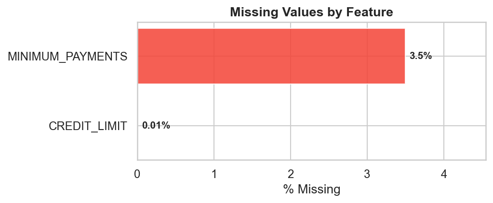

### Monetary Feature Distributions
All monetary features are **heavily right-skewed** — most customers have moderate values while a small group has very high values. This confirms the need for StandardScaler before clustering.

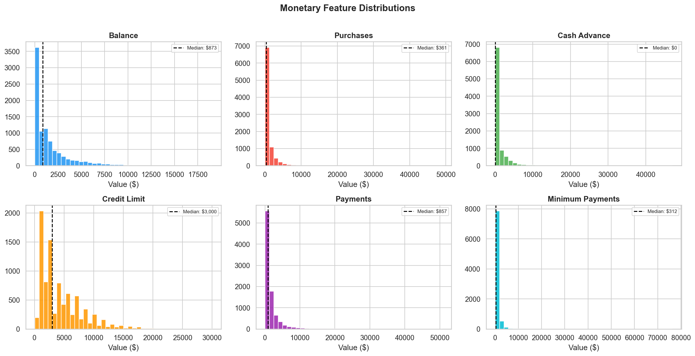

### Frequency Features
Approximately **50% of customers never take cash advances** — a strong segmentation signal. Only ~22% of customers always pay in full.

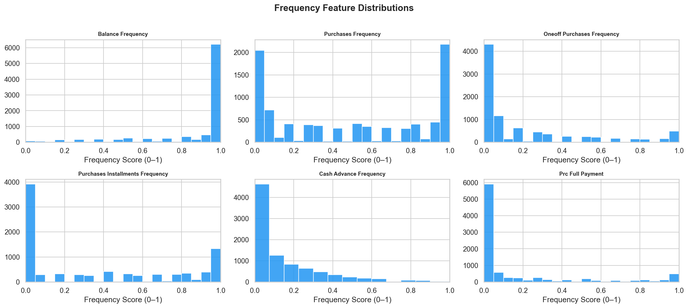

### Correlation Heatmap

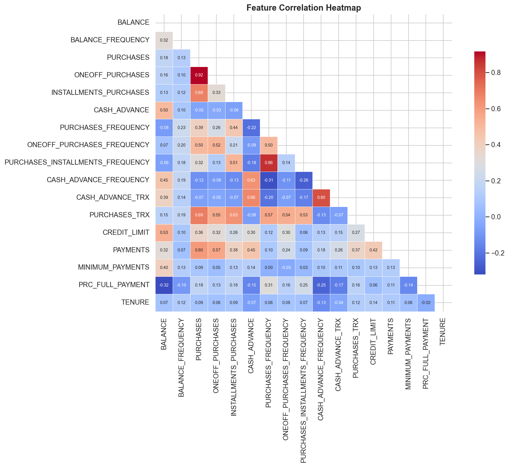

---

## Feature Engineering

7 new behavioural ratio features were created from domain knowledge:

| Feature | Formula | Business Meaning |
|---|---|---|
| `PURCHASES_TO_LIMIT_RATIO` | PURCHASES / CREDIT_LIMIT | Credit utilisation for spending |
| `CASH_ADVANCE_RATIO` | CASH_ADVANCE / BALANCE | Cash reliance vs balance held |
| `PAYMENT_TO_MINIMUM_RATIO` | PAYMENTS / MIN_PAYMENTS | Debt repayment aggressiveness |
| `MONTHLY_AVG_PURCHASE` | PURCHASES / TENURE | Average monthly spending rate |
| `INSTALLMENT_TO_PURCHASE_RATIO` | INSTALLMENTS / PURCHASES | Preference for installment buying |
| `CASH_ADVANCE_TO_CREDIT_RATIO` | CASH_ADVANCE / CREDIT_LIMIT | Cash usage vs credit limit |
| `BALANCE_TO_CREDIT_RATIO` | BALANCE / CREDIT_LIMIT | Balance utilisation rate |

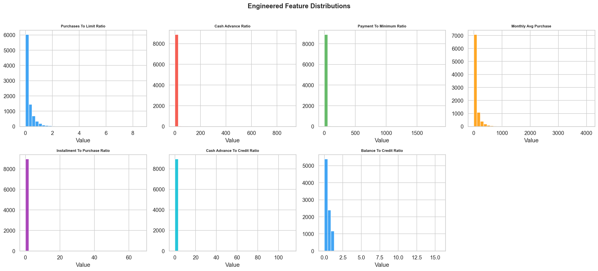

### Outlier Analysis
Outliers were **retained** — they represent genuine high-value or high-risk customers, not data errors.

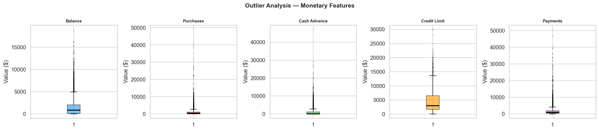

---

## Feature Selection

Before clustering, we remove noisy/redundant features using two methods to improve cluster separation.

### LASSO Feature Importance
LassoCV (L1 regularisation) shrinks weak feature coefficients to zero — 13 of 23 features had non-zero coefficients.

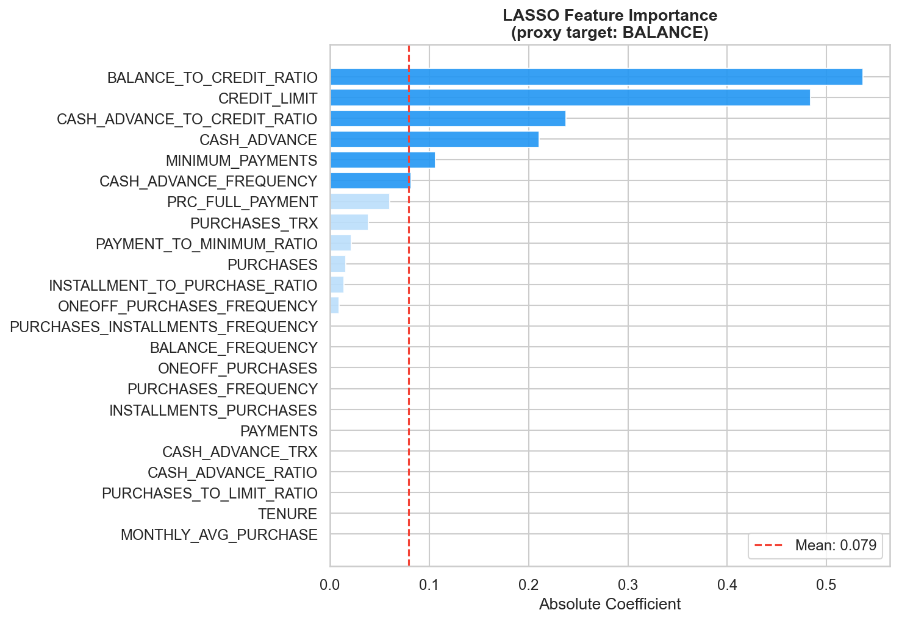

### Recursive Feature Elimination (RFE)
GradientBoosting-based RFE iteratively removes the least important features — 15 features selected.

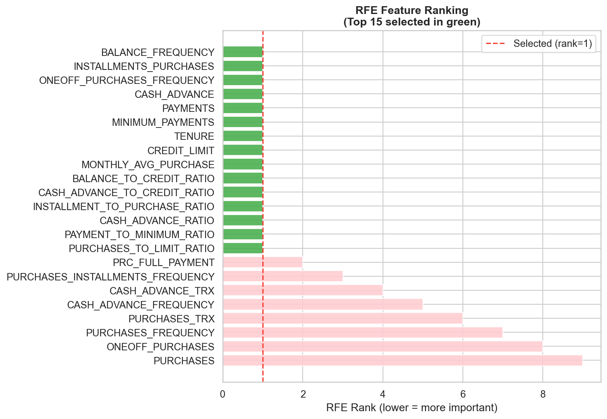

**Consensus:** Union of LASSO top-15 and RFE-selected features → **21 features** used for clustering (3 removed as noise). Silhouette Score improved after selection.

---

## Clustering Results

### Finding Optimal K
Both Elbow Method and Silhouette Score were used to determine K=4 — balancing statistical fit with business interpretability.

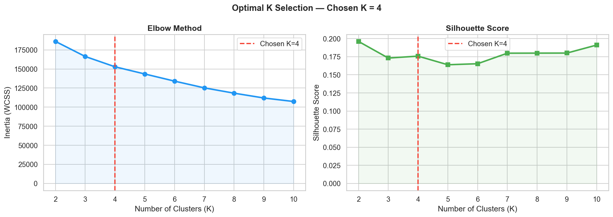

### PCA Variance
10 principal components explain **81% of total variance**.

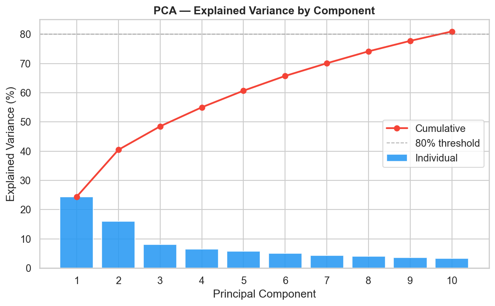

### KMeans Segments in 2D (PCA)

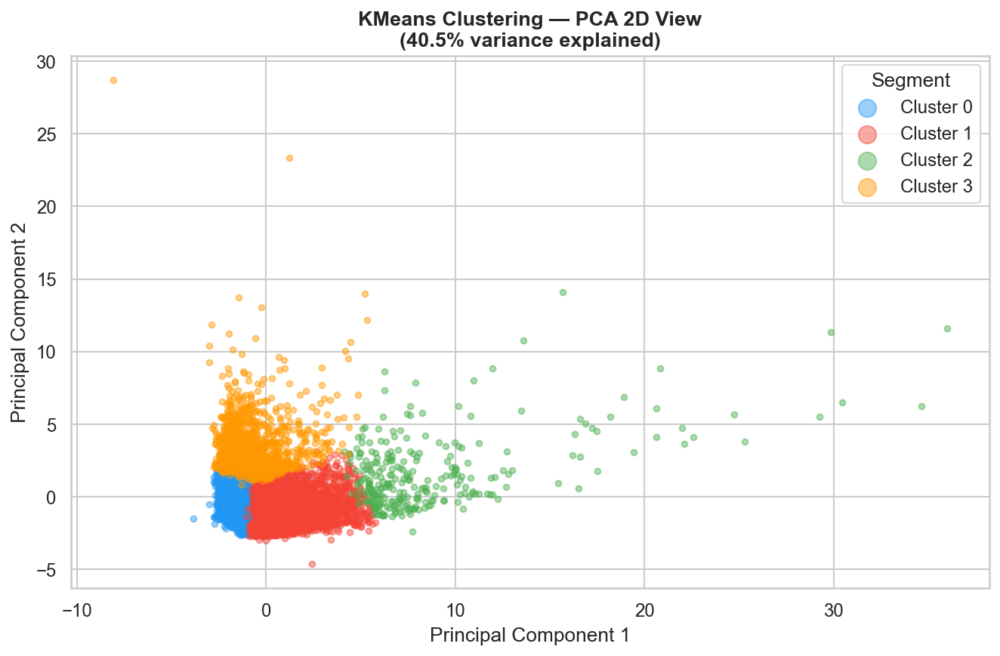

### KMeans vs Hierarchical Clustering

| Algorithm | Silhouette Score | Notes |
|---|---|---|
| **KMeans** | **0.1636** | Better cluster separation, scalable |
| Hierarchical (Ward) | 0.3173 | Strong on selected features |

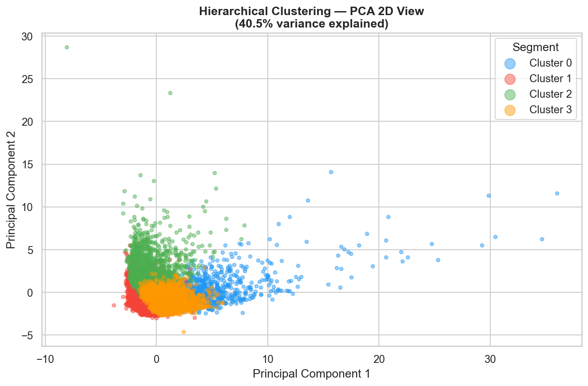

---

## PCA Comparison

A key question in clustering: should we cluster on raw features, or reduce dimensionality with PCA first?

We tested three approaches and measured Silhouette, Inertia, ARI and NMI:

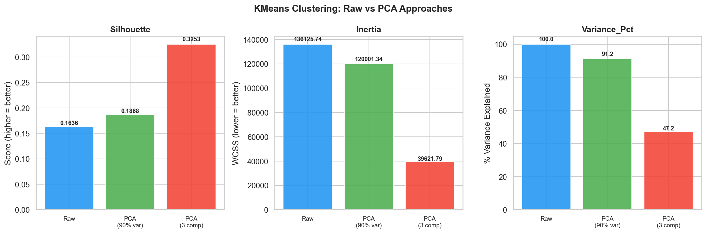

| Approach | Components | Variance % | Silhouette | Inertia | ARI | NMI |
|---|---|---|---|---|---|---|
| Raw Scaled Data | 21 | 100% | 0.1636 | 136,126 | — | — |
| PCA (13 comp, 90% var) | 13 | 91.2% | 0.1868 | 120,001 | 0.964 | 0.940 |
| **PCA (3 components)** | **3** | **47.2%** | **0.3253** | **39,622** | 0.711 | 0.697 |

**Key Finding:** PCA with just **3 components** achieves the best Silhouette Score (**0.3253** — nearly 2x the raw baseline), despite explaining only 47% of variance. Removing high-dimensional noise produces dramatically tighter clusters.

**ARI / NMI Trade-off:** PCA-3 has lower ARI/NMI vs PCA-13, meaning it discovers genuinely *different* segments — which is the goal of unsupervised learning, not replicating the raw-data structure.

---

## Customer Segment Profiles

### Segment Heatmap & Key Metrics

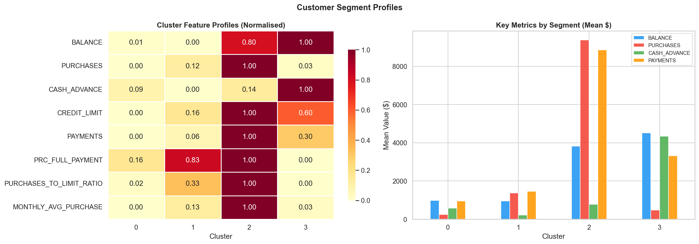

### Segment Size Distribution

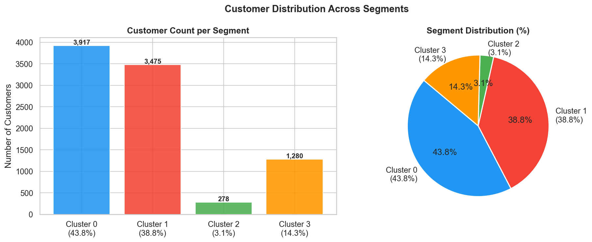

---

## Business Insights

| Cluster | Segment | Size | Avg Balance | Avg Purchases | Avg Cash Advance | Strategy |
|---|---|---|---|---|---|---|
| 0 | **Low Activity** | 3,917 (43.8%) | $984 | $248 | $573 | Re-engagement offers, spend incentives |
| 1 | **Active Transactors** | 3,475 (38.8%) | $948 | $1,376 | $216 | Premium rewards, travel miles, limit upgrades |
| 2 | **VIP / High Spenders** | 278 (3.1%) | $3,820 | $9,389 | $773 | Concierge VIP card, relationship manager |
| 3 | **Cash Advance Heavy** | 1,280 (14.3%) | $4,523 | $482 | $4,338 | Debt consolidation, financial counselling |

### Key Takeaways

1. **VIP High Spenders** (3%) generate disproportionate revenue — retention is the top priority
2. **Cash Advance Heavy** (14%) carry the highest financial risk — proactive outreach reduces default
3. **Low Activity** (44%) is the largest segment — small activation campaigns have outsized impact
4. **Active Transactors** (39%) are ideal premium card candidates — high spend, regular payers
5. StandardScaler was **essential** — without scaling, high-value monetary features dominated distance calculations and produced meaningless clusters

---

## Setup & Usage

### 1. Clone & Install
```bash
git clone https://github.com/bhavesh2418/Credit-Card-Customer-Profiling.git
cd Credit-Card-Customer-Profiling
pip install -r requirements.txt
```

### 2. Configure Credentials
```bash
cp .env.example .env
# Fill in your Kaggle API credentials and GitHub token
```

### 3. Download Dataset
```bash
python scripts/download_data.py
```

### 4. Run Full Pipeline
```bash
python main.py
```
This generates all 11 plots in `images/` and saves `reports/cluster_summary.csv`.

### 5. Explore Notebooks
Open notebooks in order: `01` → `02` → `03` → `04` → `05`

---

## Tech Stack

| Tool | Purpose |
|---|---|
| Python 3.11 | Core language |
| Pandas, NumPy | Data manipulation |
| Scikit-learn | KMeans, Hierarchical, PCA, StandardScaler, Silhouette |
| Matplotlib, Seaborn | All visualisations |
| Joblib | Model persistence |
| Jupyter Notebook | Interactive analysis |
| Kaggle API | Dataset download |

---

<p align="center">
  <strong>Bhavesh</strong> — Portfolio project demonstrating unsupervised ML, customer segmentation, and production-style workflow.<br>
  <a href="https://github.com/bhavesh2418">GitHub</a>
</p>
